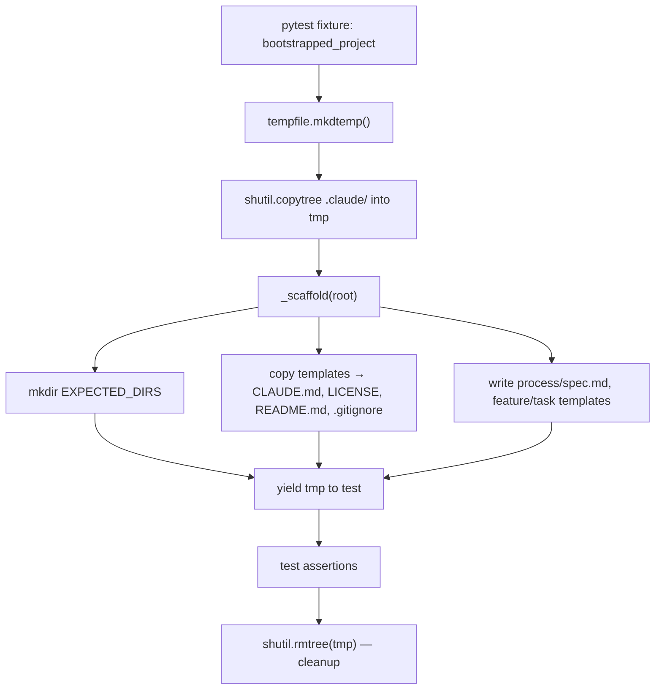

# test_bootstrap.py — Literate Walkthrough

## Purpose

This test suite verifies that the `j3` bootstrap scaffold produces the correct project structure. When a new app is bootstrapped using j3, a set of directories, template files, and configuration files must appear in the target project root. These tests run in a temporary directory and are fully self-cleaning.

---

## Pipeline Diagram



---

## Walkthrough

### Imports and Constants

Source range: [tests/test_bootstrap.py lines 1–31](tests/test_bootstrap.py#L1-L31)

The file opens with three stdlib imports and one third-party import. `shutil` handles directory copying and cleanup; `tempfile` gives us a fresh isolated directory per test run; `pathlib.Path` makes all path operations readable without string concatenation.

```python
import shutil
import tempfile
from pathlib import Path

import pytest
```

`J3_DIR` anchors to the `.claude/` directory relative to this file's location. `__file__` resolves to the test file itself; walking two levels up via `.parent.parent` lands at the repository root, then `.claude` is appended. This means the tests always find the real template files regardless of how pytest is invoked.

```python
J3_DIR = Path(__file__).parent.parent / ".claude"
```

`EXPECTED_FILES` and `EXPECTED_DIRS` are the ground-truth lists that tests assert against. Any future bootstrap changes that add or remove paths must update these lists to keep the tests in sync.

```python
EXPECTED_FILES = [
    "CLAUDE.md",
    "LICENSE",
    "README.md",
    ".gitignore",
    "process/spec.md",
    "process/features/template.md",
    "process/tasks/template.md",
]

EXPECTED_DIRS = [
    "process/features/notdone",
    "process/features/done",
    "process/tasks/notdone",
    "process/tasks/done",
]
```

---

### The `bootstrapped_project` Fixture

Source range: [tests/test_bootstrap.py lines 33–39](tests/test_bootstrap.py#L33-L39)

The fixture uses `pytest.fixture()` with `yield` so teardown happens after the test completes, even on failure. It creates a throwaway temp directory, copies the real `.claude/` tree into it (so templates are present), then calls `_scaffold()` to simulate what a real bootstrap would produce. After the test body runs, `shutil.rmtree` removes the temp tree entirely — no residual state between runs.

```python
@pytest.fixture()
def bootstrapped_project():
    tmp = Path(tempfile.mkdtemp())
    shutil.copytree(J3_DIR, tmp / ".claude")
    _scaffold(tmp)
    yield tmp
    shutil.rmtree(tmp)
```

---

### `_scaffold` — Simulating the Bootstrap

Source range: [tests/test_bootstrap.py lines 42–67](tests/test_bootstrap.py#L42-L67)

`_scaffold` mirrors what the real bootstrap command does. It creates the directory tree first, then writes each file by reading the corresponding template from the real `.claude/templates/` directory. This keeps the tests honest: the generated content is always derived from the actual template files, not hardcoded strings.

The `parents=True, exist_ok=True` flags on `mkdir` allow the nested paths (`process/features/notdone`) to be created in a single call without failing if a parent already exists.

```python
def _scaffold(root: Path):
    for d in EXPECTED_DIRS:
        (root / d).mkdir(parents=True, exist_ok=True)
```

`process/spec.md` is the one file whose content is written as a literal string rather than copied from a template. This is intentional — the spec is meant to be app-specific boilerplate that contains `<APP NAME>` and `<Describe what the app does>` placeholders.

```python
    (root / "process/spec.md").write_text(
        "# Spec for <APP NAME>\n* <Describe what the app does>\n"
    )
```

All other generated files read their content from the templates directory, which is itself copied into the temp project by the fixture.

```python
    (root / "CLAUDE.md").write_text(
        (templates / "CLAUDE.md.template").read_text()
    )
    (root / "LICENSE").write_text(
        (templates / "LICENSE.template").read_text()
    )
    (root / "README.md").write_text(
        (templates / "README.md.template").read_text()
    )
    (root / ".gitignore").write_text(
        (templates / ".gitignore.template").read_text()
    )
```

---

### Test: `.claude` Directory Exists

Source range: [tests/test_bootstrap.py lines 70–71](tests/test_bootstrap.py#L70-L71)

The simplest structural check: the fixture copies `.claude/` into the temp root, so this test would only fail if `shutil.copytree` failed silently or `J3_DIR` didn't resolve correctly.

```python
def test_j3_dir_is_present(bootstrapped_project):
    assert (bootstrapped_project / ".claude").is_dir()
```

---

### Test: Required j3 Config Files Present

Source range: [tests/test_bootstrap.py lines 74–77](tests/test_bootstrap.py#L74-L77)

Checks that the three core instruction files (`method.md`, `coding.md`, `bootstrap.md`) and the primary template (`CLAUDE.md.template`) exist inside `.claude/`. These are the files that `CLAUDE.md` references via `@` includes. If any are missing, Claude Code cannot follow the j3 workflow.

```python
def test_j3_required_files_exist(bootstrapped_project):
    for name in ["method.md", "coding.md", "bootstrap.md"]:
        assert (bootstrapped_project / ".claude" / name).exists(), f"Missing .claude/{name}"
    assert (bootstrapped_project / ".claude" / "templates" / "CLAUDE.md.template").exists()
```

---

### Test: Expected Directories Created

Source range: [tests/test_bootstrap.py lines 80–82](tests/test_bootstrap.py#L80-L82)

Iterates `EXPECTED_DIRS` and asserts each is a real directory. The error message names the missing path, which makes test failures immediately actionable without reading the traceback.

```python
def test_expected_dirs_created(bootstrapped_project):
    for d in EXPECTED_DIRS:
        assert (bootstrapped_project / d).is_dir(), f"Missing dir: {d}"
```

---

### Test: Expected Files Created

Source range: [tests/test_bootstrap.py lines 85–87](tests/test_bootstrap.py#L85-L87)

Iterates `EXPECTED_FILES` and asserts each exists as a regular file. This is a presence check only — content checks are separate tests below.

```python
def test_expected_files_created(bootstrapped_project):
    for f in EXPECTED_FILES:
        assert (bootstrapped_project / f).is_file(), f"Missing file: {f}"
```

---

### Tests: Placeholder Content

Source range: [tests/test_bootstrap.py lines 90–115](tests/test_bootstrap.py#L90-L115)

Three tests verify that the generated files contain the `<APP NAME>` placeholder string. This is the primary contract for template output: the files must be present and unfilled, so that a developer replacing `<APP NAME>` will get a personalized project. The fourth test checks that the generated `.gitignore` covers `.venv/`, which is the standard Python virtual environment directory for `uv`-managed projects.

```python
def test_claude_md_contains_app_placeholder(bootstrapped_project):
    content = (bootstrapped_project / "CLAUDE.md").read_text()
    assert "<APP NAME>" in content


def test_spec_md_contains_app_placeholder(bootstrapped_project):
    content = (bootstrapped_project / "process/spec.md").read_text()
    assert "<APP NAME>" in content


def test_license_is_mit(bootstrapped_project):
    content = (bootstrapped_project / "LICENSE").read_text()
    assert "MIT License" in content
    assert "<YEAR>" in content
    assert "<AUTHOR NAME>" in content


def test_readme_contains_app_placeholder(bootstrapped_project):
    content = (bootstrapped_project / "README.md").read_text()
    assert "<APP NAME>" in content


def test_gitignore_covers_venv(bootstrapped_project):
    content = (bootstrapped_project / ".gitignore").read_text()
    assert ".venv/" in content
```

---

## Full Source Code

Source range: [tests/test_bootstrap.py lines 1–115](tests/test_bootstrap.py#L1-L115)

```python
#!/usr/bin/env python3
# test_bootstrap.py — tests that verify j3 bootstrap produces correct project structure
# Author: Pito Salas and Claude Code
# Open Source Under MIT license

import shutil
import tempfile
from pathlib import Path

import pytest


J3_DIR = Path(__file__).parent.parent / ".claude"

EXPECTED_FILES = [
    "CLAUDE.md",
    "LICENSE",
    "README.md",
    ".gitignore",
    "process/spec.md",
    "process/features/template.md",
    "process/tasks/template.md",
]

EXPECTED_DIRS = [
    "process/features/notdone",
    "process/features/done",
    "process/tasks/notdone",
    "process/tasks/done",
]


@pytest.fixture()
def bootstrapped_project():
    tmp = Path(tempfile.mkdtemp())
    shutil.copytree(J3_DIR, tmp / ".claude")
    _scaffold(tmp)
    yield tmp
    shutil.rmtree(tmp)


def _scaffold(root: Path):
    for d in EXPECTED_DIRS:
        (root / d).mkdir(parents=True, exist_ok=True)

    templates = J3_DIR / "templates"
    (root / "CLAUDE.md").write_text(
        (templates / "CLAUDE.md.template").read_text()
    )
    (root / "process/spec.md").write_text(
        "# Spec for <APP NAME>\n* <Describe what the app does>\n"
    )
    (root / "process/features/template.md").write_text(
        (J3_DIR / "templates" / "feature-template.md").read_text()
    )
    (root / "process/tasks/template.md").write_text(
        (J3_DIR / "templates" / "task_template.md").read_text()
    )
    (root / "LICENSE").write_text(
        (templates / "LICENSE.template").read_text()
    )
    (root / "README.md").write_text(
        (templates / "README.md.template").read_text()
    )
    (root / ".gitignore").write_text(
        (templates / ".gitignore.template").read_text()
    )


def test_j3_dir_is_present(bootstrapped_project):
    assert (bootstrapped_project / ".claude").is_dir()


def test_j3_required_files_exist(bootstrapped_project):
    for name in ["method.md", "coding.md", "bootstrap.md"]:
        assert (bootstrapped_project / ".claude" / name).exists(), f"Missing .claude/{name}"
    assert (bootstrapped_project / ".claude" / "templates" / "CLAUDE.md.template").exists()


def test_expected_dirs_created(bootstrapped_project):
    for d in EXPECTED_DIRS:
        assert (bootstrapped_project / d).is_dir(), f"Missing dir: {d}"


def test_expected_files_created(bootstrapped_project):
    for f in EXPECTED_FILES:
        assert (bootstrapped_project / f).is_file(), f"Missing file: {f}"


def test_claude_md_contains_app_placeholder(bootstrapped_project):
    content = (bootstrapped_project / "CLAUDE.md").read_text()
    assert "<APP NAME>" in content


def test_spec_md_contains_app_placeholder(bootstrapped_project):
    content = (bootstrapped_project / "process/spec.md").read_text()
    assert "<APP NAME>" in content


def test_license_is_mit(bootstrapped_project):
    content = (bootstrapped_project / "LICENSE").read_text()
    assert "MIT License" in content
    assert "<YEAR>" in content
    assert "<AUTHOR NAME>" in content


def test_readme_contains_app_placeholder(bootstrapped_project):
    content = (bootstrapped_project / "README.md").read_text()
    assert "<APP NAME>" in content


def test_gitignore_covers_venv(bootstrapped_project):
    content = (bootstrapped_project / ".gitignore").read_text()
    assert ".venv/" in content
```
